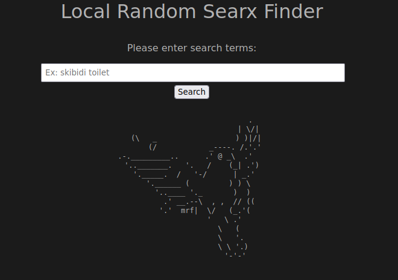

# Local Random SearX

A fork of [rndm-searx](https://github.com/ktleary/random-searx) with the ability to use search terms. I also have a version where you can do this using `?q=%s` but due to limitations with firefox I abandoned it. Let me know if you're interested.

## How it works:

1. Check [rndm-searx](https://github.com/ktleary/random-searx), as most of it is a direct copy.

2. Appends a `?q={searchterm}` to the resulant instance.

## HTML Installation

1. copy index.html and rndm-search.js in a location capable of supporting ajax
- they should be in the same folder

(OPTIONAL):

2. Include a favicon of your choice inside the same folder and rename it `favicon-searx.jpeg`.
